In this project, I explore the third party liability Motor Vehicle Insurance data of a French General Insurance company. Using bayesian approach,  MCMC method I try to predict the number of claims for a paarticular policy. Claim frequencies are generally modelled assuming that all policies have homogenous risk. But insurance industry has large hetergongenous risk. I use a bayesian model and define prior to accomodate for the heterogenity. Predicting the claim numbers for each policy can be used to develop premium based on the policy by considering various characteristic of policy holder, region etc. This will help the company provide customers dynamic premiums to customer rather than a flat premium to all. 


```r
TPL <- read.csv("freMTPL2freq.csv")
head(TPL)
```

```
##   IDpol ClaimNb Exposure Area VehPower VehAge DrivAge BonusMalus VehBrand
## 1     1       1     0.10    D        5      0      55         50      B12
## 2     3       1     0.77    D        5      0      55         50      B12
## 3     5       1     0.75    B        6      2      52         50      B12
## 4    10       1     0.09    B        7      0      46         50      B12
## 5    11       1     0.84    B        7      0      46         50      B12
## 6    13       1     0.52    E        6      2      38         50      B12
##    VehGas Density Region
## 1 Regular    1217    R82
## 2 Regular    1217    R82
## 3  Diesel      54    R22
## 4  Diesel      76    R72
## 5  Diesel      76    R72
## 6 Regular    3003    R31
```
In the dataset freMTPL2freq risk features and claim numbers were collected for 677,991 motor third-part liability policies (observed in a year). 


```r
set.seed(2000561)
tpl1 <- data.frame(na.omit(TPL))
tpl2 <- tpl1[sample(nrow(tpl1), 20000), ]
sum(tpl1$ClaimNb)/(nrow(tpl1))
```

```
## [1] 0.05324677
```

```r
sum(tpl2$ClaimNb)/(nrow(tpl2))
```

```
## [1] 0.05455
```

```r
table(tpl2$ClaimNb)
```

```
## 
##     0     1     2     3 
## 18963   987    46     4
```


```r
smp_size <- floor(0.75 * nrow(tpl2))
train_ind <- sample(seq_len(nrow(tpl2)), size = smp_size)

traintpl <- tpl2[train_ind, ]
testtpl <- tpl2[-train_ind, ]
```


The original data set has 677k rows. For ease of computation we will sample 20k rows from the data. Here, I have tried to keep the ratio of claims in both the samples equal but also drawn random sample to avoid bias. Then we divide the 20k data set to train and test. The train data consists of 15k rows and the test data has 5k rows of data.  

We will use the train data set to do some exploratory analysis and look various features in the data. All the policy ID are unique in the data set.


```r
length(unique(traintpl$IDpol)) #unique policy ID
```

```
## [1] 15000
```

```r
table(traintpl$Area)
```

```
## 
##    A    B    C    D    E    F 
## 2269 1682 4216 3338 3078  417
```

```r
table(traintpl$Region)
```

```
## 
##  R11  R21  R22  R23  R24  R25  R26  R31  R41  R42  R43  R52  R53  R54  R72 
## 1553   74  171  191 3561  240  220  603  287   50   33  923  943  393  734 
##  R73  R74  R82  R83  R91  R93  R94 
##  351   95 1858  127  755 1731  107
```

```r
table(traintpl$VehGas)
```

```
## 
##  Diesel Regular 
##    7278    7722
```

There are 22 regions in the data and 6 areas. Only 2 types of vehicle -Diesel & Regular. We are trying to predict the number of claims a certain ploicy will make in the time its in force using information about the vehicle type, characteristic of the driver and the region. As number of claims are counts we will use a poisson regression to model our data. We also know that the number of 0 in our data is too high so to avoid over dispersion we will use a zero inflated poisson model.

We look at the distribution of different variables to see their effect on the number of claims.

```r
hist(traintpl$DrivAge)
```

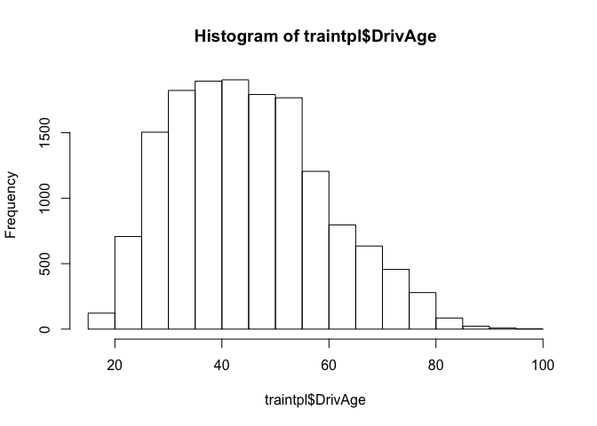<!-- -->

```r
  ggplot(traintpl,aes(x=ClaimNb,group=VehGas,fill=VehGas))+
  geom_histogram(position="dodge",binwidth=0.25)+theme_bw()
```

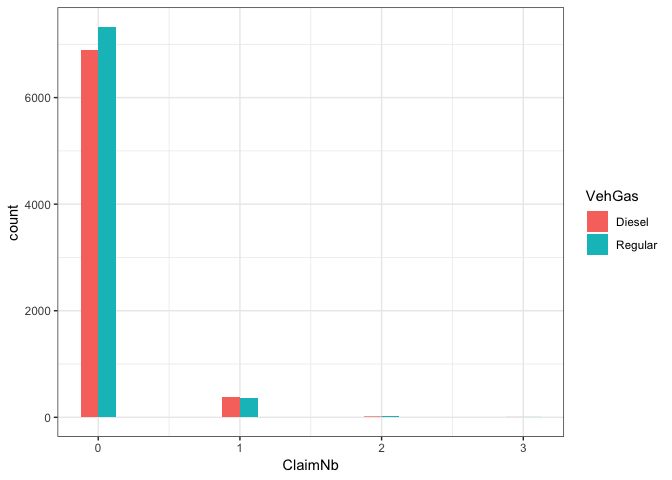<!-- -->
The type of vehicle i.e Diesel or Petrol doesn't have any effect on the number of Claims. We will not include this variable in our study.


```r
ggplot(tpl2,aes(x=DrivAge,group=as.factor(ClaimNb),fill=as.factor(ClaimNb)))+
  geom_histogram(position="identity",binwidth=0.25)+theme_bw()
```

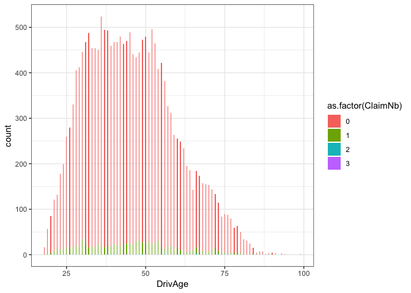<!-- -->

```r
ggplot(tpl2,aes(x=VehPower,group=as.factor(ClaimNb),fill=as.factor(ClaimNb)))+
  geom_histogram(position="dodge",binwidth=0.25)+theme_bw()
```

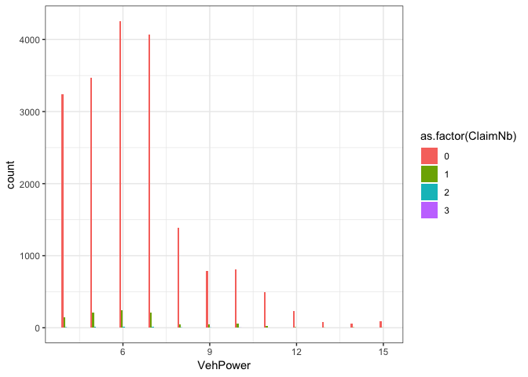<!-- -->
We can see that there is some effect of vehicle power and Drivers age on the claim numbers.

We set priors for the Cliam Numbers; we know how the insurance business works, the number of 0 claimbs for a policy in a year would be 0. More than 80% of our policies will have 0 claims and only few policies will make 1 or more claims when in force. This is challenging part of predicting the claim numbers as the event rate is too low. Using our beliefs about the prior we will build a bayesian model to accurately predict the event rate in the data.


```r
myprior <- c(prior(normal(0, 0.01), class="Intercept"),
             prior(beta(25, 5), class = zi))
post <- brm(ClaimNb ~ 1, data = traintpl, family = zero_inflated_poisson, sample_prior = "only" , prior = myprior )
```

```
## Compiling the C++ model
```

```
## Start sampling
```

```r
plin <- posterior_predict(post)
p <- prop.table(table(plin))
p[1:5]
#prop.table(table(traintpl$ClaimNb))
```


From  previous studies we know that as drivers age increases they are more prone to accidents hence and similarly as the power of vehicle increases the likelihood of accidents increase. Its also know that as the exposure( number of years since insurance) increases the chances of making a claim would increase. Using these knowledge about the motor claims we set few priors and draw from the sample.

```r
myprior1 <- c(prior(normal(0, 0.01), class="Intercept"),
             prior(beta(25, 5), class = zi),
              prior(normal(0,0.1) , class= "b" , coef = "DrivAge"),
              prior(normal(0,0.2), class= "b" , coef= "VehPower"),
              prior(normal(0.1,0.2) , class="b" , coef = "Exposure")
)

post1 <- brm(ClaimNb ~ DrivAge + VehPower + Exposure, data = traintpl, family = zero_inflated_poisson , prior = myprior1, control = list(adapt_delta = 0.9))
```

```
## Compiling the C++ model
```

```
## Start sampling
```


```r
plin1 <- posterior_predict(post1)
pptable <- prop.table(table(plin1))

pptable[1:10]
```

```
## plin1
##            0            1            2            3            4 
## 9.473761e-01 3.126233e-02 1.505382e-02 4.852817e-03 1.182550e-03 
##            5            6            7            8            9 
## 2.294167e-04 3.693333e-05 5.300000e-06 7.166667e-07 1.666667e-08
```


The Rhat = 1 , hence we know that the priors converge.


```r
marginal_effects(post1)
```

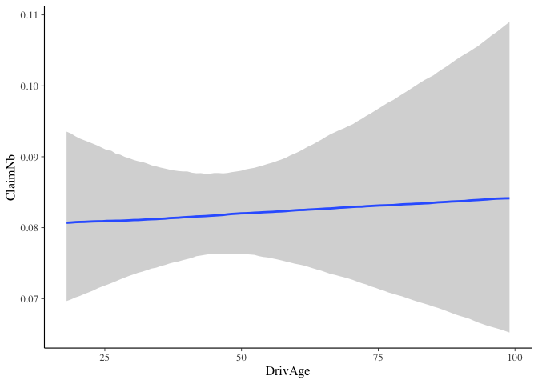<!-- -->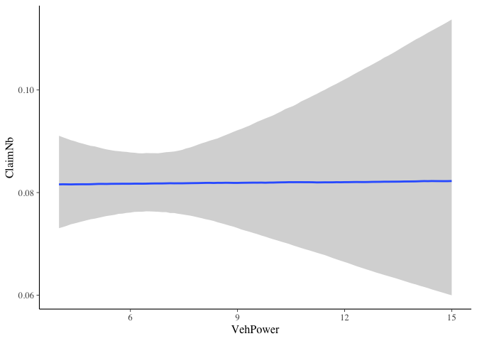<!-- -->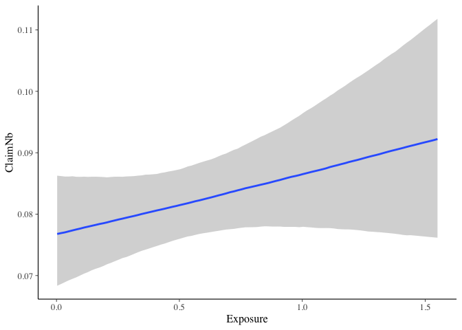<!-- -->


From the marginal plots we see that the age variable is skewed highly to fix this we can convert the age to factors and set priors for them


```r
traintpl$DrivAge <- ifelse(traintpl$DrivAge <= 25 , 1 ,ifelse( traintpl$DrivAge > 25 & traintpl$DrivAge <= 65 ,2 , 3))
traintpl$DrivAge <- as.factor(traintpl$DrivAge)
table(traintpl$DrivAge)
```

```
## 
##     1     2     3 
##   829 12685  1486
```


```r
myprior2 <- c(prior(normal(0, 0.1), class="Intercept"),
             prior(beta(25, 5), class = zi),
              prior(normal(0,0.1) , class= "b" , coef = "DrivAge2"),
              prior(normal(0.1,0.2) , class ="b" , coef ="DrivAge3"),
              prior(normal(0,0.3), class= "b" , coef= "VehPower"),
              prior(normal(0.1,0.2) , class="b" , coef = "Exposure")
)

post2 <- brm(ClaimNb ~ DrivAge + VehPower + Exposure, data = traintpl, family = zero_inflated_poisson , prior = myprior2  , control = list(adapt_delta = 0.9))
```

```
## Compiling the C++ model
```

```
## Start sampling
```


```r
plot(post2)
```

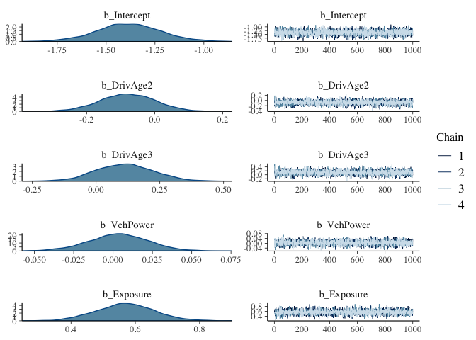<!-- -->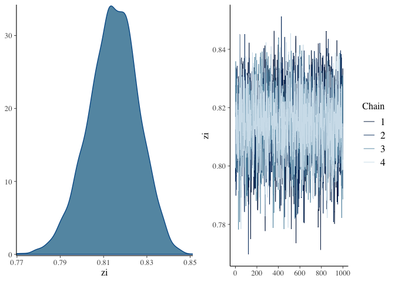<!-- -->

```r
plin2 <- posterior_predict(post2)
pp <- prop.table(table(plin2))
pp[1:6]
```

```
## plin2
##           0           1           2           3           4           5 
## 0.947589517 0.043762267 0.007618417 0.000930750 0.000090850 0.000007550
```

```r
#plot(myprior2) #plot for priors

marginal_effects(post2)
```

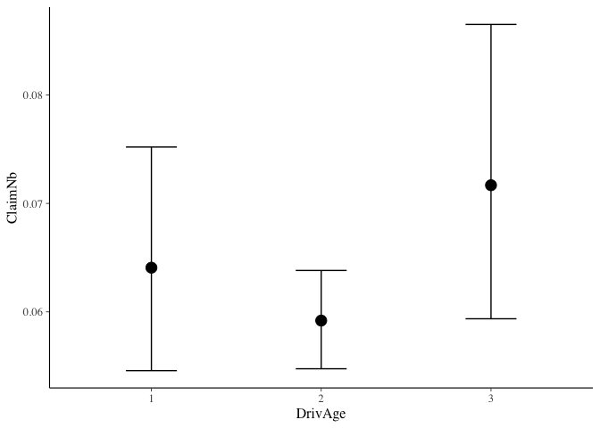<!-- -->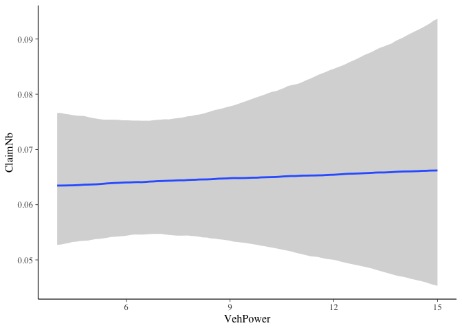<!-- -->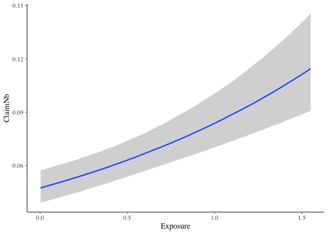<!-- -->

We will check our predicted values using the posterior distribution and the distribution from the data


```r
ppc_dens_overlay(traintpl$ClaimNb, plin1[1:50, ])
```

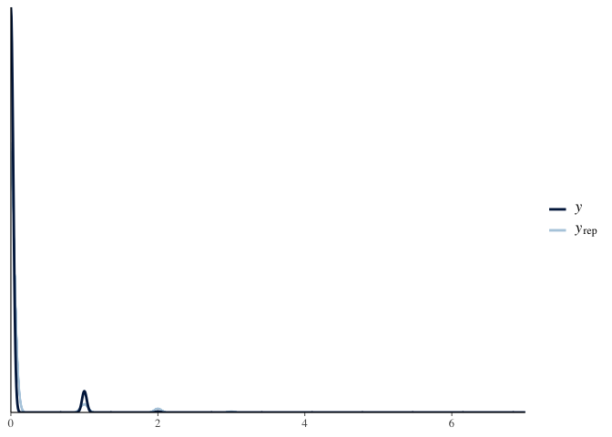<!-- -->


Both the predicted and the distribution of claim seem to overlap. We will also try to predict using the training sample.


```r
testtpl$DrivAge <- ifelse(testtpl$DrivAge <= 25 , 1 ,ifelse( testtpl$DrivAge > 25 & testtpl$DrivAge <= 65 ,2 , 3))
testtpl$DrivAge <- as.factor(testtpl$DrivAge)
pred_os <-  posterior_predict(post2 , testtpl)
ppc_dens_overlay(testtpl$ClaimNb, pred_os[1:100, ])
```

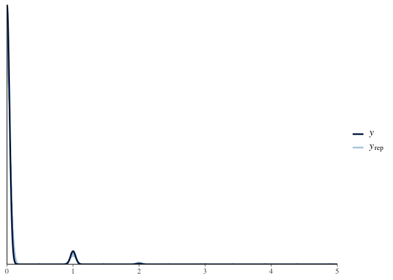<!-- -->

The model works well even in the out of sample data which is good sign. I will try to improve the model by adding some hirerachy to this model.


```r
ggplot(tpl2,aes(x=ClaimNb,group=Area,fill=Area))+
  geom_histogram(position="dodge",binwidth=0.25)+theme_bw()
```

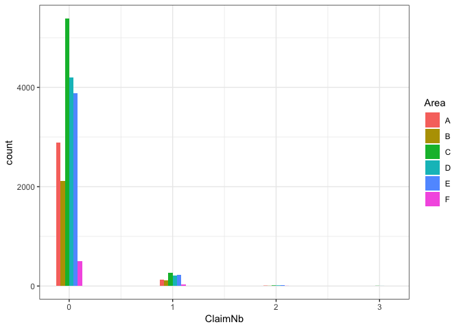<!-- -->

From the above plot we can see that few regions have higher frequency in claim 1 and 2. I would like to see if the claim frequencies differ across area. Hence I add area as a random effect in the model below. Even though the variance is not with a small sd I add Area to the model.


```r
myprior3 <- c(prior(normal(0, 0.1), class="Intercept"),
             prior(beta(25, 5), class = zi),
            prior(normal(0,0.1) , class= "b" , coef = "DrivAge2"),
            prior(normal(0.1,0.2) , class ="b" , coef ="DrivAge3"),
            prior(normal(0,0.3), class= "b" , coef= "VehPower"),
            prior(normal(0.1,0.2) , class="b" , coef = "Exposure"),
            prior(normal(0,0.2) , class ="sd" )
)

post3 <- brm(ClaimNb ~ DrivAge + VehPower + Exposure +(1|Area), data = traintpl, family = zero_inflated_poisson , prior = myprior3 , control = list(adapt_delta = 0.9))
```

```
## Compiling the C++ model
```

```
## Start sampling
```


```r
pred3 <- posterior_predict(post3 , traintpl)
pp3 <- prop.table(table(pred3))
pp3[1:5]
```

```
## pred3
##            0            1            2            3            4 
## 9.482378e-01 4.776975e-02 3.760550e-03 2.208667e-04 1.058333e-05
```


```r
pred_os1 <-  posterior_predict(post3 , testtpl)
ppc_dens_overlay(testtpl$ClaimNb, pred_os1[1:1000, ])
```

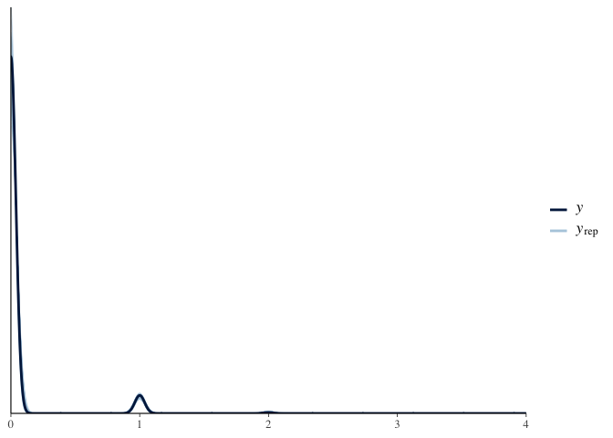<!-- -->


Now that both our models give us a good result, we will check which one does better using loo_compare and model weights.


```r
loo1 <- loo(post2)
loo2 <- loo(post3)
loo_compare(loo1 , loo2)
```

```
##       elpd_diff se_diff
## post3   0.0       0.0  
## post2 -53.4       7.0
```


```r
loo_model_weights(post2 , post3)
```

```
## Method: stacking
## ------
##       weight
## post2 0.000 
## post3 1.000
```

Both our models comparisons tell us that the model with the random effect - Area is better. The loo_model weights completely assigns the weights to model 3 clealry indicating that model with variance in area is better.
